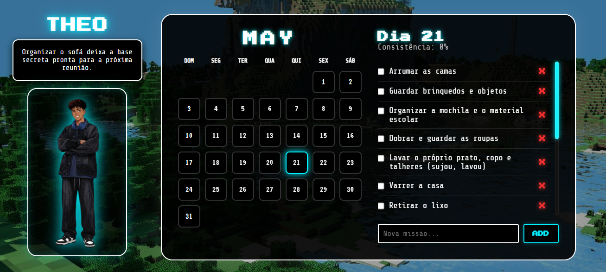

## ⚔️ Elite Habit Tracker — Disciplina com Personalidade

---

> *"Grandes rotinas não são construídas em um único dia. Elas nascem da consistência silenciosa das pequenas tarefas concluídas."*

  

---

## 👋 Por que eu criei isso?

Eu desenvolvi esse projeto porque minha rotina é intensa e eu precisava de uma forma visual, rápida e satisfatória de acompanhar tudo o que eu realmente conseguia concluir durante o dia. 🚀

O **Elite Habit Tracker** começou como uma ferramenta pessoal para transformar estudos, tarefas, metas e hábitos em algo mais organizado, visual e motivador.

Cada checklist concluído, cada bloco neon aceso e cada progresso salvo funcionavam como uma prova concreta de esforço e evolução.

Mas durante o desenvolvimento aconteceu algo que mudou completamente o projeto.

Meu sobrinho começou a acompanhar tudo o que eu estava criando e passou a se interessar genuinamente pelo sistema.

E foi aí que o projeto deixou de ser apenas uma ferramenta de produtividade.

Eu comecei a adaptar partes do visual, procurar referências de Minecraft, estudar elementos mais divertidos e modificar detalhes da interface pensando em tornar a experiência mais leve e envolvente para ele também.

Passei horas pesquisando ideias, referências visuais e pequenas mecânicas que deixassem a rotina mais divertida de acompanhar.

E sinceramente?  
Eu amei fazer isso.

O Elite Habit Tracker acabou se tornando uma mistura de:
- produtividade
- organização
- criatividade
- estética neon
- diversão
- e carinho colocado em cada detalhe do desenvolvimento

Hoje ele não é apenas um painel de hábitos.

Ele é um projeto que carrega evolução, personalidade e dedicação em cada linha.

---

## 📑 O que o Elite Habit Tracker oferece?

O projeto foi desenvolvido com foco em organização, experiência visual e funcionalidade.

### 📅 Histórico de Execução
Calendário dinâmico alinhado automaticamente pelos dias da semana (Sun–Sat), permitindo acompanhar padrões de produtividade ao longo do mês.

### ✅ Sistema de Checklist
Estrutura preparada para suportar grandes volumes de tarefas sem comprometer o layout da aplicação.

### ⚡ Interface Visual Neon
Visual moderno com elementos glow/neon que tornam a experiência mais agradável e satisfatória visualmente.

### 💾 Salvamento Automático
Persistência de dados usando LocalStorage para garantir que o progresso continue salvo mesmo após fechar o navegador.

### 🎮 Inspirações Visuais
Elementos criativos inspirados em universos como Minecraft para tornar a rotina mais divertida e menos cansativa visualmente.

---

## 🚀 Acesse o Projeto

  

---

## 🧠 Conhecimentos Aplicados

Desenvolvi o projeto pensando em robustez, escalabilidade visual e organização de código.

### 🖥️ Manipulação de DOM
Atualização dinâmica de tarefas, progresso e elementos visuais sem necessidade de recarregar a página.

### 📆 Lógica de Calendário (JavaScript)
Sistema automático para cálculo correto dos dias do mês e alinhamento semanal.

### 🎨 CSS Avançado
Uso de:
- Flexbox
- CSS Grid
- efeitos glow/neon
- controle de overflow
- responsividade
- alinhamento dinâmico

### 💾 Persistência de Dados
Utilização de LocalStorage para armazenamento automático do progresso do usuário.

### 🧩 Estrutura Modular
Separação organizada entre lógica, estilo e estrutura da aplicação para facilitar manutenção e evolução futura.

---

## 🛠️ Tecnologias Utilizadas

- HTML5
- CSS3
- JavaScript ES6+
- Google Fonts *(Uncial Antiqua & Playfair Display)*
- Git & GitHub

---

## ✨ Objetivo do Projeto

O Elite Habit Tracker nasceu da necessidade de transformar uma rotina intensa em algo:
- visual
- organizado
- motivador
- funcional
- e divertido de acompanhar

Mais do que apenas marcar tarefas, o projeto busca transformar produtividade em uma experiência mais leve e recompensadora visualmente.

Porque manter constância já é difícil o suficiente.

Então, se for para enfrentar uma rotina pesada, que seja com personalidade, criatividade e um painel neon brilhando no final do dia. ⚡

---

## 📸 Preview

  

---

## 📩 Contato

📧 **Email:** lailaamorimsant@gmail.com  
🚀 **GitHub:** https://github.com/LailaAmorim  
💼 **LinkedIn:** https://www.linkedin.com/in/laila-amorim-82542a20b

---

  Feito com ❤️ por <strong>Laila Amorim</strong>

